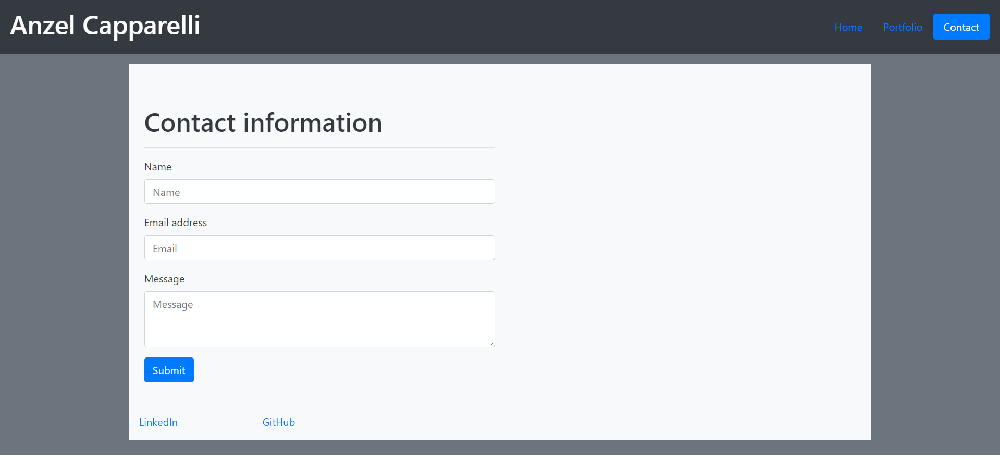
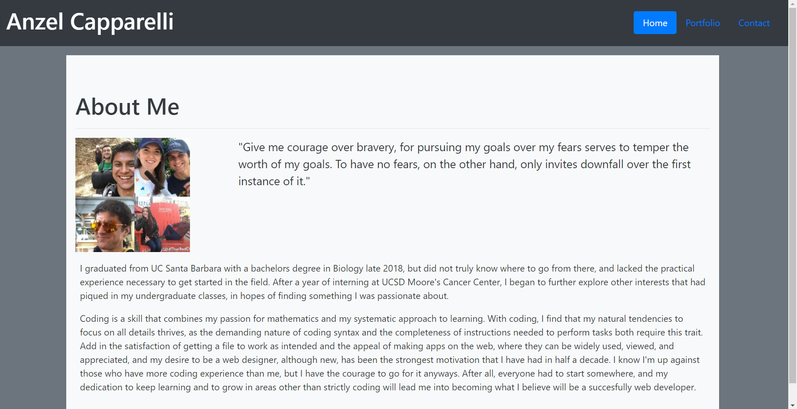
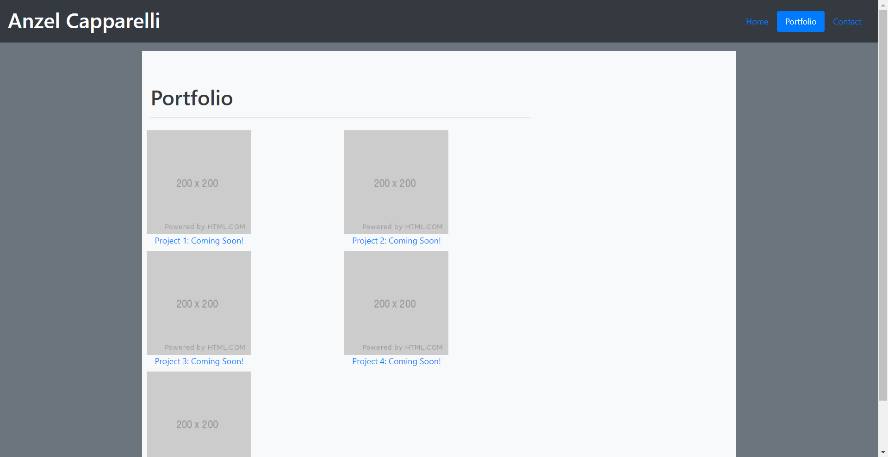
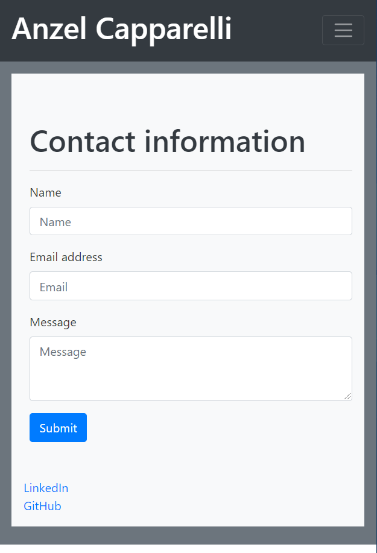

# Bootstrap Template Profile Page





## Description 

This profile page (Home Page, Portfolio Page, and Contact Page) was constructed entirely with css framework from Boostrap 4.5. The class system provided allows easy addition of webpage elements, as well as modification of these elements, all through these same classes classes. One component featured in this layout is the navbar, which by default comes with the links next to the title on the left. With Bootstrap's class customization, the color, layout, and link effects were all modifiable, ultimately resulting in the layout seen above.

```html
 <nav class="navbar navbar-expand-lg navbar-dark bg-dark"> <!--navbar-dark and bg-dark: color customizations added to default navbar-->

        <a class="navbar-brand mr-auto" href="#">
            <h1>Anzel Capparelli</h1>
        </a>

        <!-- Keeps links on right of navbar -->
        <div>
            <button class="navbar-toggler" data-toggle="collapse" data-target="#navbarSupportedContent"
                aria-controls="navbarSupportedContent" aria-expanded="false" aria-label="Toggle navigation">
                <span class="navbar-toggler-icon"></span>
            </button>


            <div class="collapse navbar-collapse" id="navbarSupportedContent">
                <ul class="nav nav-pills ml-auto">                              <!--nav-pills class: addition to nav links to get border on      
                                                                                active-->
                    <li class="nav-item">
                        <a class="nav-link" href="./index.html">Home</a>
    
```


In addition to many ready-made webpage components easily adding by referencing Bootstrap, a powerful feature that comes with Bootstraps classes for page layout customization is that their grid system classes (containers, rows, and columns) come with built-in, easily adjustable responsive screen layout. On this template, all three html pages used the grid system for their layout, allowing their content (even their images) to change layout with different viewport sizes, leading to a better experience for both desktop and mobile viewers.




In summation, this template demonstrates how Bootstrap is not only quick and convenient, but effective at increasing user experience as well.

### Deployed Link

[Marketing Template Deployed Page](https://anzelcapparelli.github.io/).


[GitHub Repository Link](https://github.com/anzelcapparelli/anzelcapparelli.github.io)


